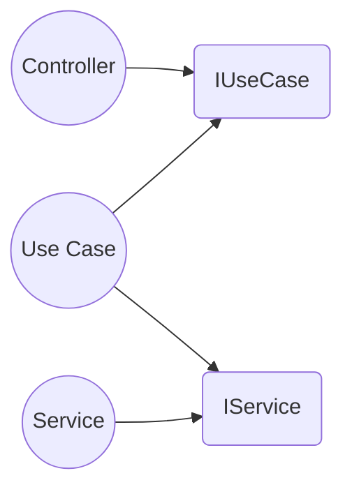
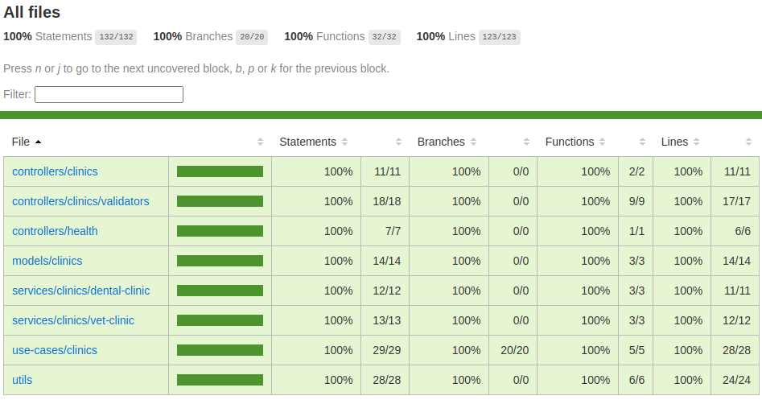

# ScratchPay API

## Description

API built with NestJS as a challenge for ScratchPay.

## Requisites

- Node.js (v16 or higher)
- NPM (v8 or higher)
- Docker (only required if running in development mode with docker)

## Project Structure



## Installation

```bash
$ npm install
```

## Running the app

```bash
# development mode
$ npm run dev

# development mode with docker
$ npm run dev:docker

# production mode
$ npm run prod
```

## Test

```bash
# unit tests
$ npm run test

# test coverage
$ npm run test:cov

# test e2e
$ npm run test:e2e
```
### Current test coverage

</img>

## API Documentation

The API documentation is available at [http://localhost:3000/api](http://localhost:3000/api)

## Stay in touch

### Leonardo Bernal
- [Email](mailto:leonardobernalmartins@gmail.com)
- [GitHub](https://github.com/LeohBernal)
- [LinkedIn](https://www.linkedin.com/in/leonardobernalmartins/)
